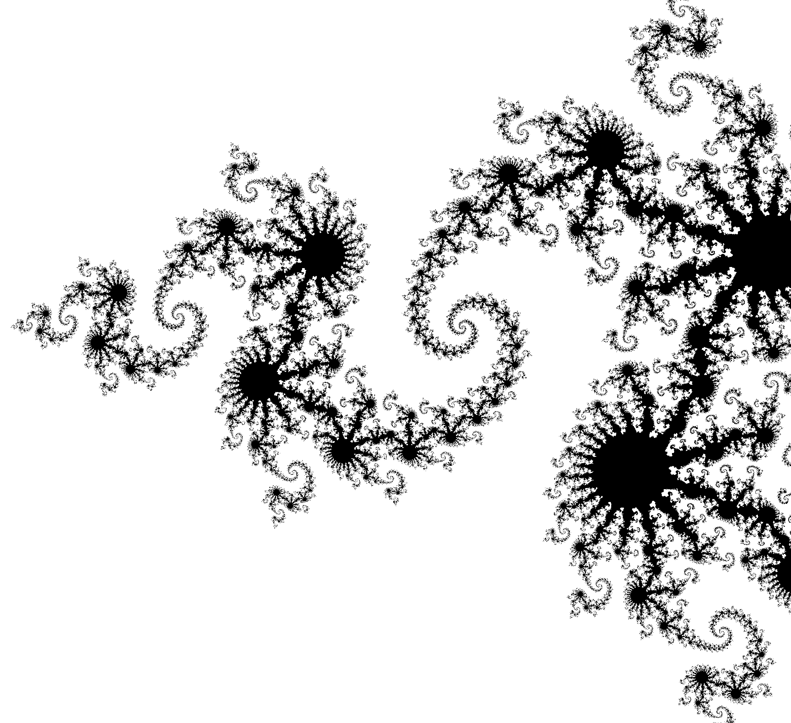
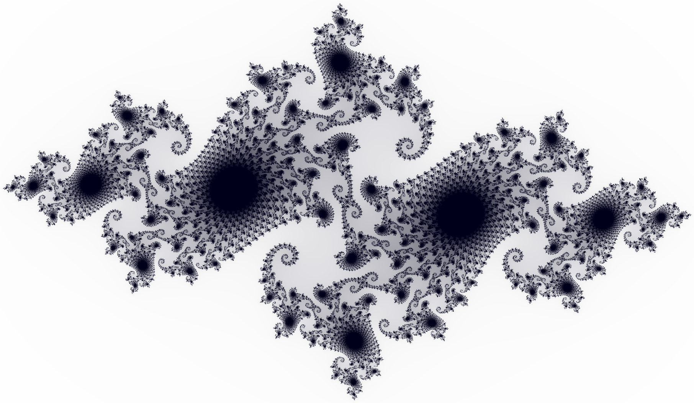
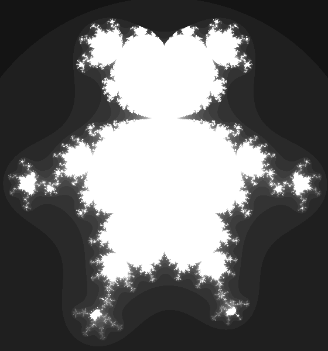

Mandel
======

Mandel is a command-line tool to generate fractal images. It is multi-threaded
and includes a light expression parser to let you define your own formulas.

Usage
-----

Build it with Gradle::

    $ gradle build

And then::

    $ java -jar Mandel.jar -area "-1.55;0.2;-0.8;0.8" -set julia -param "-0.8;0.156" -color "#FFFFFF;#000000" -resolution 1200 -iter 140

.. code-block::

    $ java -jar Mandel.jar -set julia -color "#ffffff..#00001a" -iter 250 -area "-1.51;1.51;-0.88;0.88"

Defining your own formula::

    $ java -jar Mandel.jar -transformation "-i*c*z^5+1+i" -area "-0.28;0.28;-0.1;0.5" -iter 25 -resolution 1000

For a full list of options::

    $ java -jar Mandel.jar -h
